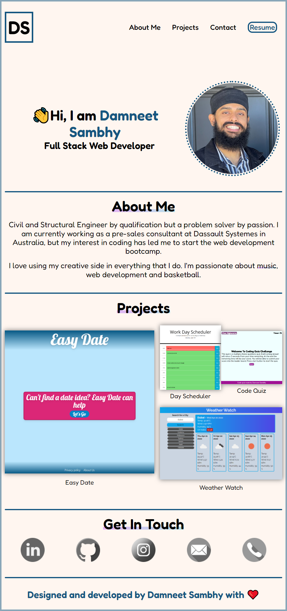

# Damneet's-Portfolio

## Goal
Design and develop personal portfolio landing page

## Website URL
https://daman29.github.io/Damneets-Portfolio/

Link above takes you to the webpage.

## Description

- Designed and developed a personal portfolio webpage
- Personal information such as a recent photo, name, and links to sections about me, my work and contact details included.
- Properly linked navigation links.
- All applications shown in the projects section with the first being the largest.
- All application links functioning and redirect in a new tab to the application.
- Responsive CSS design with accessibility standards followed.
- Semantic source code with ordered layout and comments.

## Damneet's Portfolio Overview
Below is the screen capture of the webpage.

---

## Bonus
- Animation for emojis on hover (go on test it out).
- Text highlight for important headings and links (check out the music from the about me section).
- Added resume.
- Added sweet animations for visually appealing content and capture the users attention.
- All done without JS.